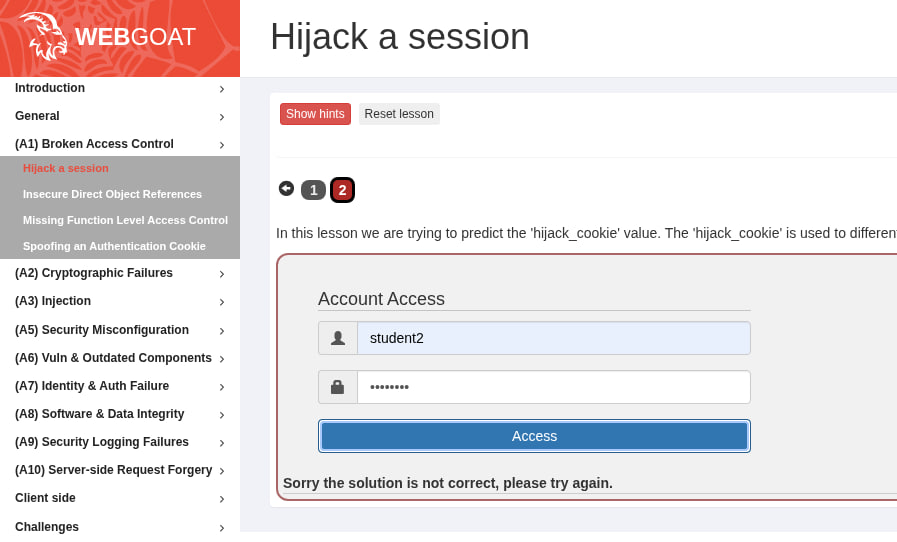
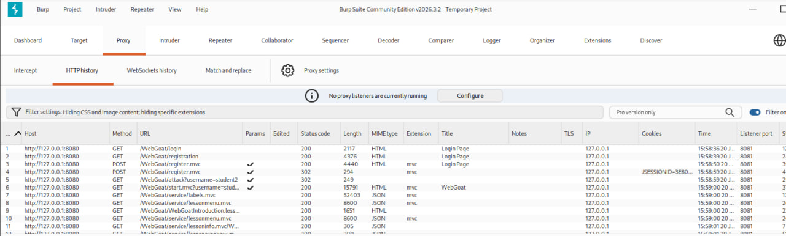
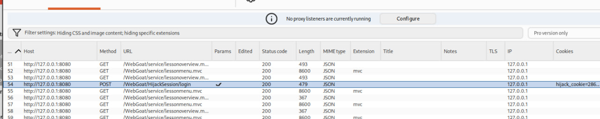

## Мета: Знайомство з A01:2025 Broken Access Control

### Середовище: Kali Linux, Docker engine, OWASP WebGoat container.

В меню обрали:

Запускаємо Burpsuit, переходимо на вкладинку "Proxy", запускаємо браузер, в якому відкриваємо "WebGoat" та створюємо користавача і логінуємся або одразу логінуємось (якщо не видаляли контейнер) та переходимо на другий крок. Натискаємо "Access", отримуємо помилку:

Повертаємось до burpsuit, де маємо передивитись вкладинку HTTPhistory:

Далі шукаємо відповідь POST, в якої міститься інформація про цю помилку (ключ - це зміст hijack_cookie, яку нам і потрібно "передбачити"):

