## OWASP Juice Shop: Початковий посібник з веб-безпеки

**OWASP Juice Shop** — це один із найкращих сучасних інструментів для вивчення веб-безпеки. Це навмисно вразливий додаток, написаний на Node.js, Express та Angular. Оскільки він містить понад 100 челенджів, цей посібник допоможе вам пройти перші ключові етапи та зрозуміти логіку гри.

Найкращий спосіб запустити додаток локально — через Docker. Це забезпечує ізоляцію та швидкий старт.

1. Встановіть Docker.
2. Виконайте команду в терміналі:
    `docker run --rm -p 3000:3000 bkimminich/juice-shop`
3. Відкрийте браузер за адресою: **http://localhost:3000**
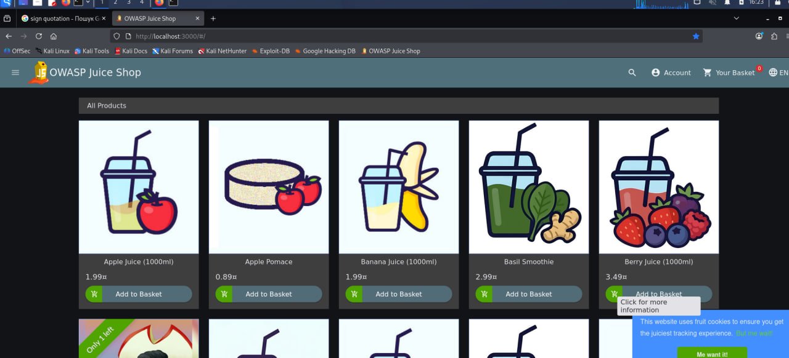

### 2. Перший крок: Пошук дошки результатів (Score Board)

У Juice Shop посилання на список завдань приховане. Ваше перше завдання — знайти його самостійно.

* **Завдання:** Знайти сторінку зі списком усіх челенджів.
* **Як пройти:** Спробуйте вгадати URL (наприклад, перевірте `/score-board` або `/scoreboard`). Розробники часто ховають такі технічні сторінки в коді або через роутинг. Зазвичай багато цікавого можна знайти у файлі `main.js`. Тобто натискаємо F12, відкривається інспектор і далі шукаємо в коді щось схоже на **scoreboard**. Отримуємо наступний результат:

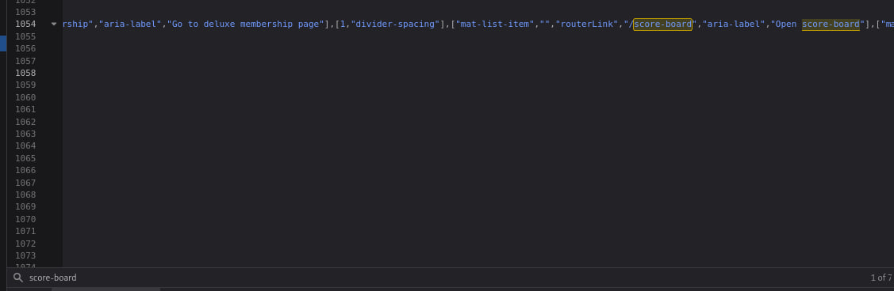

* **Пряме посилання:** http://localhost:3000/#/score-board

### 3. Рівень 1: Базові вразливості

#### Атака на пошуковий рядок (DOM XSS)
* **Завдання:** Виконати XSS-атаку.
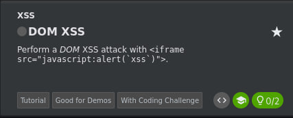
* **Як пройти:** У полі пошуку (Search) вгорі сторінки введіть скрипт:
    `<iframe src="javascript:alert('xss')">`
* **Результат:** Має з'явитися вікно з повідомленням, після чого челендж буде зараховано.
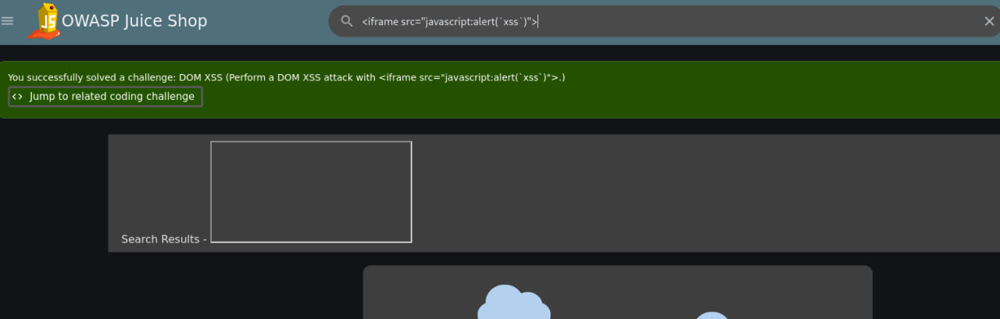
* **Додатково** робимо відправку пейлоада і тримуємо такий результат
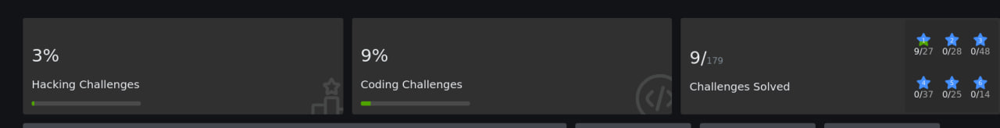

#### Витік конфіденційних даних (Sensitive Data Exposure)
* **Завдання:** Знайти файл, який не має бути публічним.
Спочатку шукаємо відкриті директорії, але отримуємо помилку:
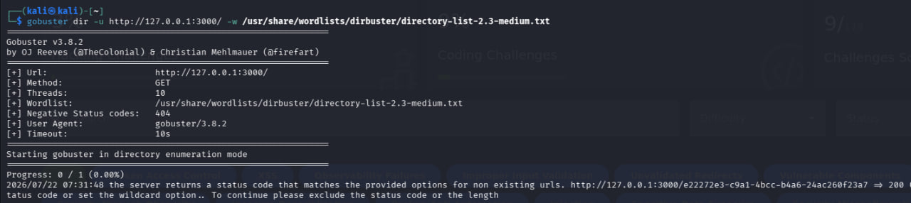
Вносимо зміни, які нам рекомендовано, та знову запускаємо сканування:
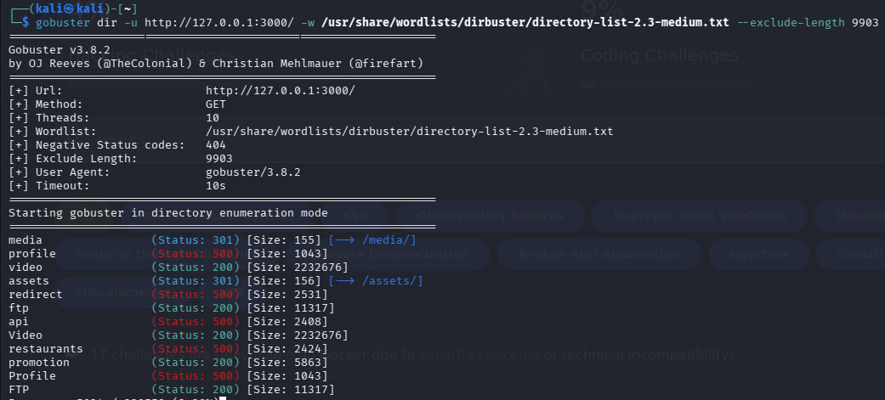
Випадково :-) проходимо *Security misconfiguration*, зламавши *ДжусіШоп*:
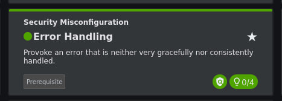
Перезпускаємо контейнер та йдемо до знайденого FTP:
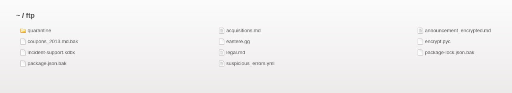

* **Як пройти:** Перейдіть до директорії **http://localhost:3000/ftp**. Там зазвичай знаходяться бекапи або `.md` файли. 
* **Підказка:** Спробуйте завантажити файли, які сервер намагається блокувати, використовуючи обхід фільтрів (наприклад, додаючи `%2500.md` до назви).

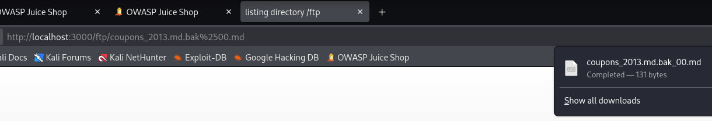
Як результат - пройшли ще декілька завдань:
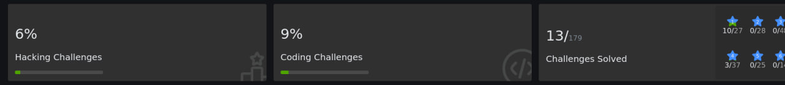

### 4. Рівень 2: Злам акаунтів (Authentication)

#### Адмінська панель (SQL Injection)
Це класична атака, яка дозволяє увійти в систему без знання пароля.

1. Перейдіть на сторінку **Login**.
2. Введіть у поле Email: `' or 1=1--`
3. Введіть будь-який пароль.

Має виглядати наступним чином:
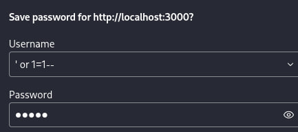

**Чому це працює?**
Запит до бази даних виглядає приблизно так:
$SELECT * FROM Users WHERE email = '' OR 1=1--' AND password = '...'$

Оскільки умова `1=1` завжди істинна, а символи `--` закоментовують решту запиту (перевірку пароля), ви автоматично увійдете під першим користувачем у базі — зазвичай це адміністратор.

