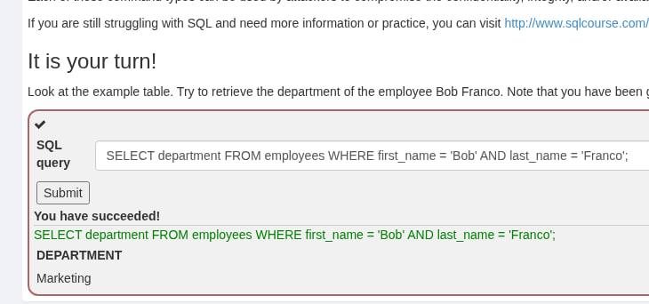
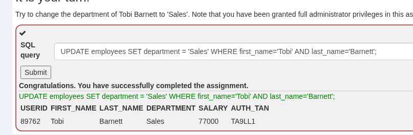
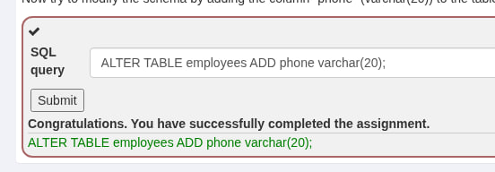
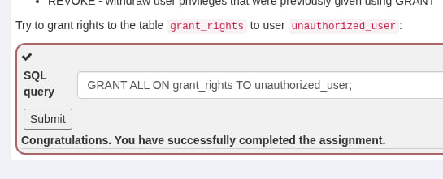
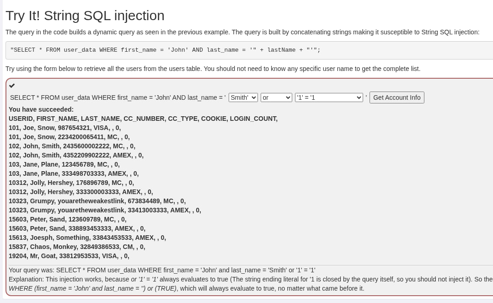

### Практика
Подивись на приклад таблиці. Спробуй отримати назву відділу (**department**) співробітника **Bob Franco**. Зауваж, що в цьому завданні тобі надано повні права адміністратора, і ти можеш отримати доступ до всіх даних без автентифікації.



### Практика
Спробуй змінити відділ (**department**) для співробітника **Tobi Barnett** на **'Sales'**. Зауваж, що в цьому завданні тобі надано повні права адміністратора, і ти можеш змінювати дані без додаткової автентифікації.


---

**Правильний запит для розв'язання завдання:**
```sql
UPDATE employees 
SET department = 'Sales' 
WHERE first_name = 'Tobi' AND last_name = 'Barnett';
```


### Практика
Тепер спробуй змінити схему таблиці, додавши стовпець **"phone"** (тип даних `varchar(20)`) до таблиці **"employees"**.

> **Підказка:** Для зміни структури вже існуючої таблиці використовується комбінація команд `ALTER TABLE` та `ADD`.

---

**Правильний запит для розв'язання завдання:**
```sql
ALTER TABLE employees ADD phone varchar(20);
```



Це завдання демонструє, як ін'єкція може дозволити хакеру не просто вкрасти дані, а змінити саму архітектуру бази, наприклад, додавши нові поля для збору шкідливої інформації або видаливши критично важливі індекси.


### Практика
Спробуй надати всі права (права доступу) на таблицю **`grant_rights`** користувачеві **`unauthorized_user`**.

> **Підказка:** Типова структура команди для надання повних прав виглядає так: `GRANT ALL ON [назва_таблиці] TO [ім'я_користувача]`.

---

**Правильний запит для розв'язання завдання:**
```sql
GRANT ALL ON grant_rights TO unauthorized_user;
```



Це завдання підкреслює найнебезпечніший аспект ін'єкцій: можливість повного захоплення контролю над системою керування базами даних (RDBMS).

Це розділ, який пояснює, чому SQLi посідає високі позиції в рейтингах уразливостей (як-от **OWASP Top 10**). Вона вражає всі три стовпи інформаційної безпеки: **Confidentiality** (Конфіденційність), **Integrity** (Цілісність) та **Availability** (Доступність).

Цей розділ підкреслює, що хоча SQLi є універсальною загрозою, її реальний вплив залежить від конфігурації сервера та архітектури додатка. Наприклад, неправильно налаштований **SQL Server** може дозволити хакеру отримати повний контроль над операційною системою сервера, а не лише над даними.

Запит у коді будує динамічний запит, як було показано в попередньому прикладі. Запит створюється шляхом конкатенації (об'єднання) рядків, що робить його вразливим до рядкової SQL-ін'єкції:

`"SELECT * FROM user_data WHERE first_name = 'John' AND last_name = '" + lastName + "'";`

Спробуй використати форму нижче, щоб отримати всіх користувачів із таблиці `users`. Тобі не потрібно знати жодного конкретного імені користувача, щоб отримати повний список.



---

**Твій запит був:** `SELECT * FROM user_data WHERE first_name = 'John' and last_name = 'Smith' or '1' = '1'`

**Пояснення:**
Ця ін'єкція працює, тому що вираз `or '1' = '1'` завжди повертає значення **true** (істинно). 
*(Зверни увагу: закриваюча одинарна лапка для `'1'` додається самим кодом запиту, тому тобі не потрібно вводити її в кінці ін'єкції).*

Отже, впроваджений запит фактично виглядає так:
`SELECT * FROM user_data WHERE (first_name = 'John' and last_name = 'Smith') or (TRUE)`

Ця умова завжди буде істинною, незалежно від того, що було вказано в запиті раніше. В результаті база даних ігнорує фільтрацію за ім'ям та прізвищем і повертає всі доступні записи з таблиці.

---

### Практика. Числова SQL-ін'єкція
Запит у коді будує динамічний запит, як і в попередньому прикладі. У цьому випадку запит створюється шляхом конкатенації (об'єднання) **чисел**, що робить його вразливим до числової SQL-ін'єкції:

`"SELECT * FROM user_data WHERE login_count = " + Login_Count + " AND userid = " + User_ID;`

Використовуючи два поля вводу нижче, спробуй отримати всі дані з таблиці `users`.  
**Увага:** Лише одне з цих полів є вразливим до SQL-ін'єкції. Тобі потрібно з'ясувати, яке саме, щоб успішно отримати всі дані.

**Login_Count:** `1`  
**User_Id:** `1 OR 1=1`

---


### Ви успішно впоралися!
Отримано дані: **USERID, FIRST_NAME, LAST_NAME, CC_NUMBER, CC_TYPE, COOKIE, LOGIN_COUNT**

| USERID | FIRST_NAME | LAST_NAME | CC_NUMBER | CC_TYPE | LOGIN_COUNT |
| :--- | :--- | :--- | :--- | :--- | :--- |
| 101 | Joe | Snow | 987654321 | VISA | 0 |
| 101 | Joe | Snow | 2234200065411 | MC | 0 |
| 102 | John | Smith | 2435600002222 | MC | 0 |
| 102 | John | Smith | 4352209902222 | AMEX | 0 |
| 103 | Jane | Plane | 123456789 | MC | 0 |
| 103 | Jane | Plane | 333498703333 | AMEX | 0 |
| ... | ... | ... | ... | ... | ... |

**Ваш запит був:** `SELECT * From user_data WHERE Login_Count = 1 and userid = 1 OR 1=1`

---

### Пояснення різниці
На відміну від рядкової ін'єкції, тут значення не беруться в одинарні лапки (`'`). 

1.  **Рядкова ін'єкція:** Потребує закриття лапки (`' OR '1'='1`).
2.  **Числова ін'єкція:** Працює безпосередньо з цифрами (`1 OR 1=1`). 

Оскільки вразливе поле `User_Id` не перевіряється на тип даних і просто додається до рядка запиту, додавання `OR 1=1` робить усю умову `WHERE` істинною для кожного рядка в базі даних. У результаті ви отримуєте повний список користувачів разом із їхніми номерами кредитних карток (**CC_NUMBER**).

---

### Порушення конфіденційності за допомогою рядкової SQL-ін'єкції

Якщо система вразлива до SQL-ін'єкцій, аспекти **тріади CIA** (конфіденційність, цілісність, доступність) цієї системи можуть бути легко скомпрометовані. У наступних трьох уроках ви дізнаєтеся, як порушити кожен аспект тріади CIA, використовуючи такі техніки, як **рядкові SQL-ін'єкції** або **ланцюжки запитів** (query chaining).

У цьому уроці ми розглянемо **конфіденційність**. Зловмисник може легко порушити конфіденційність за допомогою SQL-ін'єкції; наприклад, успішна атака може дозволити нападнику прочитати конфіденційні дані, такі як номери кредитних карток, із бази даних.


### Що таке рядкова SQL-ін'єкція?
Якщо додаток будує SQL-запити шляхом простого об'єднання (конкатенації) рядків, наданих користувачем, він, швидше за все, дуже вразливий до рядкової SQL-ін'єкції.

Зокрема, якщо рядок користувача потрапляє в SQL-запит без будь-якого очищення або підготовки, ви можете змінити поведінку запиту, просто вставивши лапки в поле вводу. Наприклад, ви можете завершити рядковий параметр лапкою і після цього ввести власний SQL-код.

---

### Практика
Ви — співробітник на ім'я **John Smith**, який працює у великій компанії. У компанії є внутрішня система, яка дозволяє всім працівникам бачити власні дані, такі як відділ, у якому вони працюють, і їхня заробітна плата.

Система вимагає від співробітників використання унікального **номера автентифікації (TAN)** для перегляду своїх даних.
Ваш поточний TAN — **3SL99A**.

Оскільки у вас завжди є бажання бути найбільш високооплачуваним працівником, ви хочете використати вразливість системи так, щоб замість перегляду власних даних **побачити дані всіх своїх колег** і перевірити їхні зарплати.

Використовуйте форму нижче та спробуйте отримати всі дані про співробітників із таблиці **`employees`**. Вам не потрібно знати конкретні імена або TAN-номери інших людей, щоб отримати необхідну інформацію.

Ви вже з'ясували, що запит, який виконує ваш запит, виглядає так:
`"SELECT * FROM employees WHERE last_name = '" + name + "' AND auth_tan = '" + auth_tan + "'";`

---

**Підказка для розв'язання:**
Вам потрібно "зламати" логіку запиту так, щоб умова `WHERE` завжди була істинною. Оскільки в запиті використовується оператор `AND`, обидві частини умови мають бути істинними, АБО ви можете використати оператор `OR`, щоб нівелювати значення першої частини.


---

### Порушення цілісності за допомогою ланцюжків запитів (Query chaining)

Після компрометації конфіденційності даних у попередньому уроці, цього разу ми збираємося порушити **цілісність** даних, використовуючи техніку **ланцюжків SQL-запитів**.

Якщо в системі існує достатньо серйозна вразливість, SQL-ін'єкція може бути використана для компрометації цілісності будь-яких даних у базі. Успішна ін'єкція дозволяє зловмиснику змінювати інформацію, до якої він навіть не повинен мати доступу.


### Що таке ланцюжок SQL-запитів?
Ланцюжок запитів (Query chaining) — це саме те, як воно звучить. Ви намагаєтеся додати один або кілька додаткових запитів у кінець основного запиту. Ви можете зробити це за допомогою метасимвола **`;`**. 
Символ `;` позначає кінець оператора SQL; він дозволяє почати інший запит одразу після початкового, навіть не починаючи новий рядок.

---

### Практика
Ви щойно дізналися, що Тобі та Боб заробляють більше грошей, ніж ви! Звичайно, ви не можете це так залишити.
Краще підіть і **змініть власну зарплату**, щоб заробляти найбільше!

**Пам’ятайте:** Ваше ім'я — **John Smith**, а ваш поточний TAN — **3SL99A**.

---

### Рішення завдання:

Вам потрібно в одне з полів (наприклад, у поле прізвища) ввести команду, яка спочатку закриє основний запит, а потім запустить ваш власний запит на оновлення даних (`UPDATE`).

**Введіть у поле Employee Name:**
```sql
Smith'; UPDATE employees SET salary = '999999' WHERE last_name = 'Smith' --
```
*(Поле TAN можна залишити порожнім або ввести будь-що)*.

**Як це працює технічно:**
Ваш ввід перетворює один запит на два окремих:
1.  `SELECT * FROM employees WHERE last_name = 'Smith';` (Перший запит знаходить вас).
2.  `UPDATE employees SET salary = '999999' WHERE last_name = 'Smith';` (Другий запит змінює вашу зарплату).
3.  `--` (Коментує залишок оригінального коду, щоб не виникло помилки синтаксису).


**Зверніть увагу:** Не всі бази даних дозволяють виконувати ланцюжки запитів за замовчуванням (наприклад, PHP з драйвером `mysql` цього не дозволяє, а `mysqli` або `PDO` залежно від налаштувань можуть дозволяти). Проте в навчальному середовищі WebGoat це спрацює, демонструючи максимальний рівень загрози.

---

### Порушення доступності (Availability)

Після успішної компрометації конфіденційності та цілісності в попередніх уроках, ми переходимо до третього елемента тріади CIA: **доступності**.

Існує багато різних способів порушити доступність. Якщо обліковий запис видалено або його пароль змінено, справжній власник більше не може отримати доступ до нього. Зловмисники також можуть спробувати видалити частини бази даних або навіть видалити всю базу даних (використовуючи `DROP`), щоб зробити дані недоступними. Відкликання прав доступу в адміністраторів або інших користувачів — ще один спосіб порушити доступність; це завадить користувачам отримати доступ до певних частин бази даних або до всієї системи загалом.

---

### Практика
Тепер ви — найбільш високооплачуваний працівник у вашій компанії. Але чи бачите ви це? Схоже, існує таблиця **`access_log`**, де фіксуються всі ваші дії!

Краще підіть і **повністю видаліть її**, поки ніхто нічого не помітив.

---

### Рішення завдання:

Вам потрібно використати техніку ланцюжків запитів (`query chaining`), яку ви вивчили в минулому уроці, щоб виконати команду видалення об'єкта бази даних (**DDL**).

**Введіть у поле Employee Name:**
```sql
Smith'; DROP TABLE access_log --
```
*(Поле TAN можна залишити порожнім).*


**Як це працює технічно:**
1.  `SELECT * FROM employees WHERE last_name = 'Smith';` — Виконується перший (оригінальний) запит.
2.  `;` — Ставиться крапка з комою, що завершує перший оператор.
3.  `DROP TABLE access_log` — Виконується ваша шкідлива команда, яка повністю знищує таблицю з логами вашої активності.
4.  `--` — Коментує залишок оригінального запиту, щоб уникнути помилки синтаксису через незакриті лапки.

**Наслідок:** Таблиця `access_log` перестає існувати. Адміністратори більше не зможуть побачити, хто і коли змінював зарплату, оскільки джерело цієї інформації (доступність даних) було знищено.
